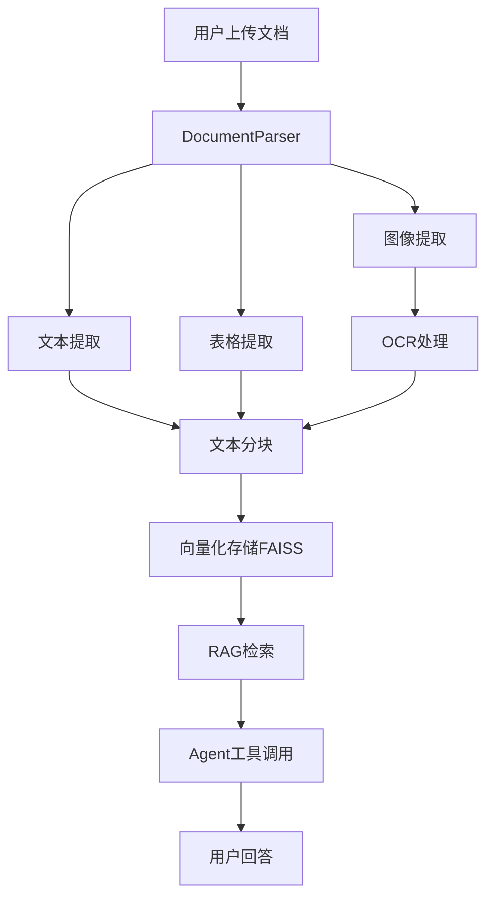

# AI Office Assistant - 技术架构文档

## 📋 项目概述

AI Office Assistant 是一个基于多模态大语言模型的智能文档分析系统，专注于通信工程领域的文档处理和数据提取。系统采用混合工作台架构，结合了可预测的直接工具调用和灵活的AI Agent能力。

### 🎯 核心目标
- **文档解析**: 支持PDF、DOCX、TXT格式的文档处理
- **多模态分析**: 提取并分析文本、表格、图像内容
- **智能问答**: 基于RAG的文档内容问答
- **专业计算**: 针对通信工程的参数提取和链路预算计算
- **持久化存储**: 跨会话的知识库管理

## 🏗️ 系统架构

### 1. 核心组件

```
┌─────────────────────────────────────────────────────────────┐
│                    Streamlit Web UI (app.py)                │
├─────────────────────────────────────────────────────────────┤
│                 AgentEngine (rag_engine.py)                 │
│  ┌─────────────────┐  ┌──────────────────┐  ┌─────────────┐ │
│  │   RAG Chain     │  │   Agent Tools    │  │  LLM Core   │ │
│  │   (FAISS)       │  │   (4 Tools)      │  │ (GPT-4o-mini)│ │
│  └─────────────────┘  └──────────────────┘  └─────────────┘ │
├─────────────────────────────────────────────────────────────┤
│              DocumentParser (document_parser.py)             │
│  ┌─────────────┐  ┌─────────────┐  ┌─────────────────────┐  │
│  │ PDF Parser  │  │ DOCX Parser │  │    OCR Engine       │  │
│  │ (PyMuPDF)   │  │(python-docx)│  │ (pytesseract+PIL)   │  │
│  └─────────────┘  └─────────────┘  └─────────────────────┘  │
└─────────────────────────────────────────────────────────────┘
```

### 2. 数据流程



## 🛠️ **技术栈**

### **核心框架**
- **Frontend**: Streamlit 1.46.1 (Web UI)
- **Backend**: Python 3.10.16 + Virtual Environment (.venv)
- **AI Framework**: LangChain 0.3.26 (Agent orchestration)
- **LLM**: OpenAI GPT-4o-mini (Text generation & reasoning)
- **Embeddings**: OpenAI text-embedding-3-small (Vector embeddings)

### **文档处理栈**
- **PDF Processing**: PyMuPDF 1.26.3 (Text, tables, images)
- **DOCX Processing**: python-docx 1.2.0 (Text, tables, images)
- **OCR Engine**: Tesseract 5.5.1 + pytesseract 0.3.13
  - **Multi-config OCR**: 4种不同配置自动重试
  - **Quality validation**: 文本长度和字符类型检查
  - **Fallback handling**: 智能错误处理和用户反馈
  - **Clean text extraction**: 简化OCR输出格式，减少不必要的分隔符
- **Image Processing**: Pillow 11.0.0 (Image manipulation)

### **向量数据库**
- **Vector Store**: FAISS 1.11.0 (Local vector storage)
- **Persistence**: File-based storage in `persistent_storage/`
- **Smart Chunking**: 自适应分块策略
  - **Small files** (<500 chars): 动态调整到内容的80%
  - **Medium files** (500-2000 chars): chunk_size=500
  - **Large files** (>2000 chars): chunk_size=1000
  - **OCR-aware**: 正确识别OCR内容的实际长度
- **Quality Control**: 过滤无意义的空chunks

### **Agent Architecture**
- **Agent Type**: OpenAI Tools Agent with custom tools
- **Tools Available**:
  - `knowledge_base_qa`: RAG-based Q&A
  - `summarize_document`: Multi-language summarization
  - `extract_technical_specifications`: Structured data extraction
  - `calculate_link_budget`: Communication engineering calculations

### **开发环境**
- **Dependency Management**: requirements.txt (16 core packages)
- **Virtual Environment**: Python venv (.venv/) for isolation
- **Version Control**: Git + GitHub
- **Development Tools**: 
  - Code structure: Modular architecture (5 main modules)
  - Error handling: Comprehensive try-catch with user-friendly messages
  - Logging: Detailed console output for debugging

## 🚀 当前功能特性

### ✅ 已实现功能

#### 1. **多格式文档解析** (V1.0)
- **PDF解析**: 文本、表格、图像提取
- **DOCX解析**: 段落、表格、图像提取  
- **TXT解析**: 纯文本处理
- **OCR支持**: 图片文字识别 (可选依赖)

#### 2. **持久化知识库** (V2.0)
- **FAISS向量存储**: 本地持久化
- **增量更新**: 动态添加/删除文档
- **会话恢复**: 页面刷新后状态保持
- **重复检测**: 防止重复文件上传

#### 3. **混合工作台** (V3.1)
- **直接工具**: 文档总结、删除等常用操作
- **AI Agent**: 复杂查询和跨文档分析
- **专业工具**: 通信工程参数提取和计算

#### 4. **专业化Agent** (V3.0)
- **知识库问答**: 基于RAG的文档检索
- **文档总结**: 多语言支持
- **参数提取**: 结构化技术规格提取
- **链路预算计算**: 通信工程专用计算工具

#### 5. **用户体验优化**
- **错误处理**: 友好的错误信息和异常处理
- **文件去重**: 智能检测和跳过重复文件
- **UI优化**: 响应式设计和直观操作
- **多语言**: 支持多语言文档总结

### 🔧 技术架构特点

#### **模块化设计**
```
src/
├── document_parser.py    # 文档解析核心
├── rag_engine.py        # AI Agent引擎
└── app.py              # Web界面控制器
```

#### **Agent工具系统**
1. **knowledge_base_qa**: 通用文档问答
2. **summarize_document**: 文档总结（支持多语言）
3. **extract_technical_specifications**: 技术参数提取
4. **calculate_link_budget**: 链路预算计算

#### **数据持久化**
```
persistent_storage/
├── vector_store/        # FAISS向量索引
└── metadata.json       # 文档元数据
```

## 📊 SOTA图像数据提取调研

### 🏆 当前最佳实践

#### **1. 多模态LLM方法 (推荐)**
- **优势**: 端到端处理，理解上下文，准确率高
- **代表**: GPT-4o, DocOwl 1.5, SmolDocling
- **适用**: 表格结构理解，图表数据提取

#### **2. 传统OCR + 深度学习**
- **优势**: 结构识别精确，成本较低
- **代表**: Table Transformer (TATR) + Tesseract
- **适用**: 规整表格，标准化文档

#### **3. 专用视觉模型**
- **代表**: VDInstruct, H-Reducer
- **特点**: 内容感知标记化，3.6x token减少

### 📈 性能对比 (基于最新研究)
| 方法 | 表格结构准确率 | 文本内容准确率 | 计算效率 |
|------|---------------|---------------|----------|
| 多模态LLM | ⭐⭐⭐⭐ | ⭐⭐⭐⭐⭐ | ⭐⭐⭐ |
| 传统OCR+CV | ⭐⭐⭐⭐⭐ | ⭐⭐⭐ | ⭐⭐⭐⭐⭐ |
| 专用视觉模型 | ⭐⭐⭐⭐ | ⭐⭐⭐⭐ | ⭐⭐⭐⭐ |

## 🎯 发展路线图

### 🚧 近期计划 (Q1 2025)

#### **增强图像处理能力**
- [ ] 集成GPT-4o Vision API进行图像内容分析
- [ ] 实现表格图像的结构化数据提取
- [ ] 优化OCR + 多模态LLM混合处理

#### **专业化工具扩展**
- [ ] 增加更多通信工程计算工具
- [ ] 支持频谱分析和信道建模
- [ ] 集成常用通信标准和规范

#### **用户体验提升**
- [ ] 实现对话历史持久化
- [ ] 按文档锚定的微对话功能
- [ ] 改进文件上传和处理流程

### 🔮 中期规划 (Q2-Q3 2025)

#### **多模态能力增强**
- [ ] 整合SmolDocling等SOTA模型
- [ ] 实现chart-to-data的智能转换
- [ ] 支持手绘图表和草图分析

#### **企业级功能**
- [ ] 多用户支持和权限管理
- [ ] 云端部署和横向扩展
- [ ] API接口和第三方集成

#### **智能化升级**
- [ ] 基于使用模式的智能推荐
- [ ] 自动化工作流构建
- [ ] 领域知识图谱集成

### 🌟 长期愿景 (Q4 2025+)

#### **通用化平台**
- [ ] 支持更多垂直领域(金融、医疗、法律)
- [ ] 可配置的专业工具系统
- [ ] 自定义Agent训练和部署

#### **高级AI能力**
- [ ] 多Agent协作系统
- [ ] 自我学习和知识更新
- [ ] 端到端的文档编辑和生成

## 💡 创新亮点

### **1. 混合工作台架构**
- 结合确定性工具和灵活Agent
- 平衡可预测性和智能化
- 适应不同用户技能水平

### **2. 通信工程专业化**
- 垂直领域深度优化
- 专业计算工具集成
- 行业标准数据库

### **3. 多模态文档理解**
- 文本、表格、图像统一处理
- 上下文感知的数据提取
- OCR与LLM协同工作

### **4. 持久化知识管理**
- 增量式知识库构建
- 跨会话状态保持
- 智能文档索引和检索

## 🏆 竞争优势

| 维度 | 我们的优势 | 市场现状 |
|------|-----------|----------|
| **专业性** | 通信工程垂直优化 | 通用化方案为主 |
| **架构** | 混合工作台设计 | 纯Agent或纯工具 |
| **成本** | 本地部署 + 合理API使用 | 高昂的商业API |
| **可控性** | 开源可定制 | 黑盒商业产品 |
| **集成度** | 端到端解决方案 | 需要多工具组合 |

---

*最后更新: 2025年1月* | *版本: v3.1* | *维护者: AI Office Assistant Team* 