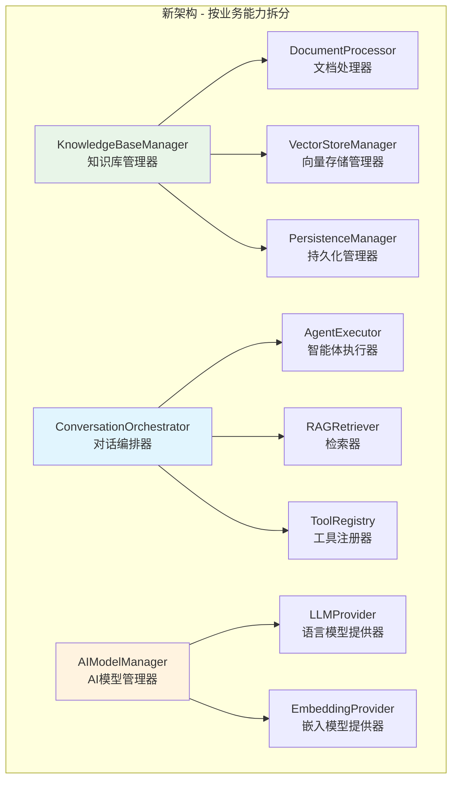
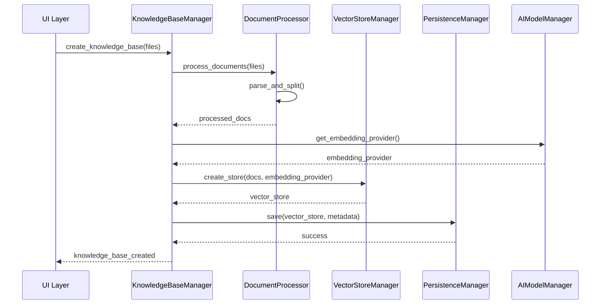
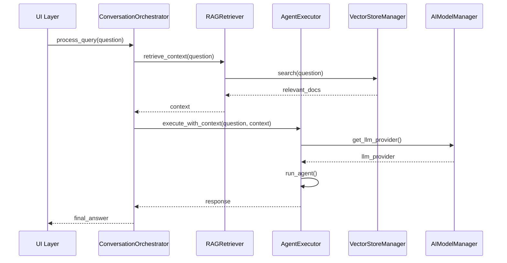

# 🏗️ 架构重构计划

## 📋 重构目标

基于业界最佳实践和单一职责原则，将当前的 `AgentEngine` 拆分为多个职责清晰的模块，提高代码的可维护性、可测试性和可扩展性。

---

## 🔍 当前问题分析

### 现状：`AgentEngine` 承担过多职责

当前的 `AgentEngine` 类承担了以下6大职责：

1. **🤖 AI模型管理**：LLM、Embeddings 初始化和配置
2. **🗄️ 知识库管理**：文档处理、向量存储、FAISS 管理
3. **🔧 工具编排**：Agent 工具管理和注册
4. **💾 持久化管理**：状态保存/加载、元数据管理
5. **🎯 对话执行**：Agent 执行、RAG 链构建
6. **📄 文档处理**：文本分割、块验证、内容清理

### 问题影响

- **违反单一职责原则**：一个类承担太多不相关的职责
- **命名不够描述性**：`Engine` 这个名称过于抽象
- **难以单独测试**：各个功能耦合在一起
- **难以独立扩展**：修改一个功能可能影响其他功能
- **团队协作困难**：不同团队成员难以同时开发不同功能

---

## 🎯 新架构设计

### 架构原则

1. **单一职责原则**：每个类只负责一个业务领域
2. **描述性命名**：类名直接体现其功能
3. **高内聚低耦合**：相关功能聚合，无关功能分离
4. **依赖注入**：通过接口依赖，便于测试和替换

### 模块拆分



---

## 📦 详细模块设计

### 1. 知识库管理域 (`src/core/knowledge/`)

#### `KnowledgeBaseManager`
- **职责**：知识库的整体生命周期管理
- **方法**：`create()`, `update()`, `delete()`, `list_documents()`
- **依赖**：DocumentProcessor, VectorStoreManager, PersistenceManager

#### `DocumentProcessor`  
- **职责**：文档解析、文本分割、内容验证
- **方法**：`process_documents()`, `split_text()`, `validate_content()`
- **依赖**：DocumentParser

#### `VectorStoreManager`
- **职责**：向量存储的创建、查询、更新
- **方法**：`create_store()`, `add_documents()`, `search()`, `delete_documents()`
- **依赖**：FAISS, EmbeddingProvider

#### `PersistenceManager`
- **职责**：知识库状态的持久化保存和加载
- **方法**：`save()`, `load()`, `exists()`, `clear()`

### 2. 对话管理域 (`src/core/conversation/`)

#### `ConversationOrchestrator`
- **职责**：编排整个对话流程，协调各个组件
- **方法**：`start_conversation()`, `process_query()`, `get_response()`
- **依赖**：AgentExecutor, RAGRetriever, ToolRegistry

#### `AgentExecutor`
- **职责**：执行AI Agent，处理工具调用
- **方法**：`execute()`, `build_agent()`, `set_tools()`
- **依赖**：LLMProvider, ToolRegistry

#### `RAGRetriever`
- **职责**：检索增强生成的实现
- **方法**：`retrieve()`, `build_context()`, `generate_answer()`
- **依赖**：VectorStoreManager, LLMProvider

#### `ToolRegistry`
- **职责**：工具的注册、管理和发现
- **方法**：`register_tool()`, `get_tools()`, `find_tool()`

### 3. AI模型管理域 (`src/core/models/`)

#### `AIModelManager`
- **职责**：AI模型的统一管理和配置
- **方法**：`get_llm()`, `get_embedding()`, `configure()`
- **依赖**：LLMProvider, EmbeddingProvider

#### `LLMProvider`
- **职责**：语言模型的提供和配置
- **方法**：`get_model()`, `configure_model()`, `estimate_cost()`

#### `EmbeddingProvider`
- **职责**：嵌入模型的提供和配置  
- **方法**：`get_embeddings()`, `embed_documents()`, `embed_query()`

---

## 🔄 数据流设计

### 文档上传流程


### 对话查询流程


---

## 📁 文件结构

```
src/core/
├── __init__.py
├── session.py                 # 保持不变
├── parser.py                  # 保持不变
├── tools/                     # 保持不变
│   └── ...
├── knowledge/                 # 新增：知识库管理域
│   ├── __init__.py
│   ├── manager.py            # KnowledgeBaseManager
│   ├── document_processor.py # DocumentProcessor  
│   ├── vector_store.py       # VectorStoreManager
│   └── persistence.py        # PersistenceManager
├── conversation/             # 新增：对话管理域
│   ├── __init__.py
│   ├── orchestrator.py       # ConversationOrchestrator
│   ├── agent_executor.py     # AgentExecutor
│   ├── rag_retriever.py      # RAGRetriever
│   └── tool_registry.py      # ToolRegistry
└── models/                   # 新增：AI模型管理域
    ├── __init__.py
    ├── manager.py            # AIModelManager
    ├── llm_provider.py       # LLMProvider
    └── embedding_provider.py # EmbeddingProvider
```

---

## 🚀 迁移策略

### 阶段1：创建新模块框架
1. 创建新的目录结构
2. 实现基础类和接口
3. 编写单元测试

### 阶段2：逐步迁移功能
1. 先迁移独立性强的模块（如 AIModelManager）
2. 再迁移核心业务逻辑（如 KnowledgeBaseManager）
3. 最后迁移编排逻辑（如 ConversationOrchestrator）

### 阶段3：集成和验证
1. 创建新的主入口类（可能叫 `AssistantService`）
2. 更新UI层调用
3. 端到端测试验证

### 阶段4：清理和优化
1. 删除旧的 `engine.py`
2. 更新文档和架构图
3. 性能优化和错误处理改进

---

## ✅ 重构收益

### 代码质量
- **可读性**：每个类的职责一目了然
- **可测试性**：可以单独测试每个模块
- **可维护性**：修改一个功能不会影响其他功能

### 团队协作
- **并行开发**：不同团队成员可以同时开发不同模块
- **专业化**：团队成员可以专注于特定领域
- **代码审查**：更容易进行针对性的代码审查

### 系统扩展
- **功能扩展**：更容易添加新的知识库类型或对话模式
- **性能优化**：可以针对特定模块进行优化
- **技术升级**：更容易替换底层技术栈

---

## 🎯 成功指标

1. **代码覆盖率**：每个模块达到80%以上测试覆盖率
2. **圈复杂度**：每个方法的圈复杂度小于10
3. **耦合度**：模块间依赖关系清晰，避免循环依赖
4. **性能**：重构后系统性能不下降
5. **功能完整性**：所有现有功能正常工作

这个重构计划将显著提升代码质量，使系统更加专业、清晰和易于维护。
