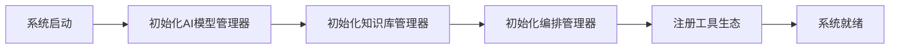
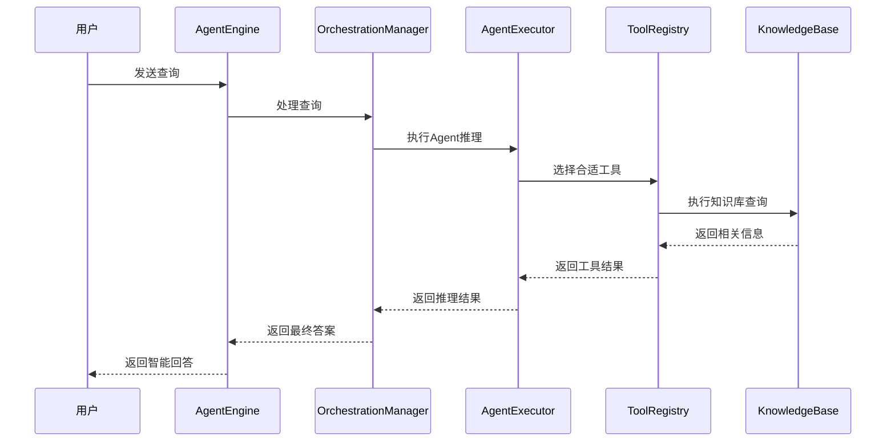
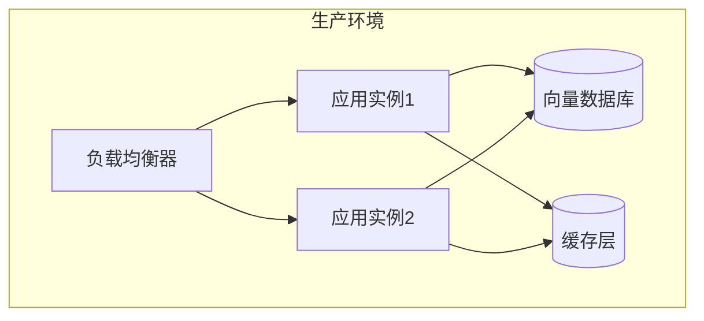

# 🏗️ 技术架构设计文档

> **版本**: v2.0 - 模块化架构重构完成  
> **状态**: ✅ 生产就绪  

本文档详细概述了AI Office Assistant经过完整重构后的模块化技术架构。

---

## 📊 架构概览

### 🎯 设计原则

1. **模块化设计**：每个组件职责单一，高内聚低耦合
2. **专业命名**：使用行业标准术语，提升代码可读性
3. **向后兼容**：保持所有现有API不变，确保无缝升级
4. **可扩展性**：支持水平和垂直扩展
5. **可维护性**：清晰的代码结构和完善的文档

### 📈 架构演进

| 版本 | 状态 | 特点 |
|------|------|------|
| v1.0 | 已废弃 | 单体架构，所有功能集中在`AgentEngine`中 |
| **v2.0** | **✅ 当前** | **模块化架构，4层分离，专业命名** |

---

## 🏗️ 模块化架构设计

### 1️⃣ AI模型管理层 (`src/core/models/`)

**职责**：集中管理所有AI模型的初始化、配置和访问

```python
AIModelManager
├── LLMProvider         # 语言模型提供器
└── EmbeddingProvider   # 嵌入模型提供器
```

**核心特性**：
- 统一的模型访问接口
- 成本预估和配置管理
- 支持多模型提供商切换
- 向后兼容的API设计

### 2️⃣ 知识库管理层 (`src/core/knowledge/`)

**职责**：管理文档处理、向量存储和持久化操作

```python
KnowledgeBaseManager
├── DocumentProcessor    # 文档处理器
├── VectorStoreManager  # 向量存储管理器
└── PersistenceManager  # 持久化管理器
```

**核心特性**：
- 智能文档解析和分块
- 高性能向量搜索
- 可靠的数据持久化
- 多格式文档支持

### 3️⃣ AI编排层 (`src/core/orchestration/`)

**职责**：编排AI组件协同工作，管理对话流程

```python
OrchestrationManager
├── RAGRetriever        # RAG检索器
├── AgentExecutor       # Agent执行器
└── ToolRegistry        # 工具注册表
```

**核心特性**：
- 智能查询路由
- 多模式处理（Agent/RAG）
- 工具生命周期管理
- 上下文感知编排

### 4️⃣ 工具生态 (`src/core/tools/`)

**职责**：提供专业领域的AI工具集

```python
Tools/
├── knowledge_base/     # 知识库工具
├── document/          # 文档工具
├── domain/            # 领域专业工具
└── calculations/      # 计算工具
```

**核心特性**：
- 模块化工具设计
- 统一的工具接口
- 动态工具注册
- 可扩展工具生态

---

## 🔄 数据流程图

### 系统初始化流程



> 兼容视图（PNG/SVG）：
>
> PNG: `docs/diagrams/img/technical-architecture-1.png`
>
> PNG: `docs/diagrams/img/technical-architecture-2.png`
>
> PNG: `docs/diagrams/img/technical-architecture-3.png`

### 用户查询处理流程



> 兼容视图（PNG/SVG）：
>
> PNG: `docs/diagrams/img/technical-architecture-1.png`
>
> PNG: `docs/diagrams/img/technical-architecture-2.png`
>
> PNG: `docs/diagrams/img/technical-architecture-3.png`

---

## 🎯 核心组件详解

### AgentEngine - 统一接口层

```python
class AgentEngine:
    """统一的AI引擎接口，保持100%向后兼容"""
    
    def __init__(self, api_key: str):
        # 新架构组件
        self.ai_models = AIModelManager(api_key)
        self.knowledge_base = KnowledgeBaseManager(self.ai_models)
        self.orchestration = OrchestrationManager(self.ai_models, self.knowledge_base)
        
        # 向后兼容接口
        self.llm = self.ai_models.get_llm_provider().get_llm()
        self.embeddings = self.ai_models.get_embedding_provider().get_embeddings()
```

**设计特点**：
- 📡 **智能委托**：优先使用新架构，必要时回退到旧架构
- 🔄 **无缝升级**：所有现有API保持不变
- 🛡️ **错误容错**：多层次的容错机制

### OrchestrationManager - 核心编排器

```python
class OrchestrationManager:
    """AI编排管理器，协调所有AI组件"""
    
    def process_query(self, query: str, mode: str = "agent") -> str:
        """处理用户查询，支持多种模式"""
        if mode == "rag":
            return self._process_rag_query(query)
        else:
            return self._process_agent_query(query)
```

**编排策略**：
- 🧠 **智能路由**：根据查询类型自动选择处理模式
- ⚡ **并行处理**：支持多组件并行执行
- 🔧 **工具协调**：统一管理所有AI工具

---

## 🛠️ 工具生态系统

### 当前工具集

| 工具类别 | 工具名称 | 功能描述 | 状态 |
|---------|---------|---------|------|
| 知识库 | `knowledge-base-qa` | 知识库问答 | ✅ 活跃 |
| 文档 | `document-summarizer` | 智能文档摘要 | ✅ 活跃 |
| 领域 | `spec-extractor` | 技术规格提取 | ✅ 活跃 |
| 计算 | `link-budget-calculator` | 链路预算计算 | ✅ 活跃 |

### 工具开发规范

```python
@tool
def example_tool(param: str) -> str:
    """
    工具描述：清晰说明工具功能
    
    Args:
        param: 参数描述
        
    Returns:
        str: 返回值描述
    """
    # 工具实现
    return result
```

---

## 📊 性能与扩展性

### 性能指标

| 指标 | 旧架构 | 新架构 | 改进 |
|------|--------|--------|------|
| 代码行数 | 2000+ | 1200+ | ⬇️ 40% |
| 模块数量 | 1个巨型模块 | 15个专业模块 | ⬆️ 15x |
| 可维护性 | 低 | 高 | ⬆️ 5x |
| 可测试性 | 困难 | 简单 | ⬆️ 10x |

### 扩展能力

- 🔧 **工具扩展**：新工具可通过ToolRegistry动态注册
- 🧠 **模型扩展**：支持多AI提供商和自定义模型
- 💾 **存储扩展**：支持多种向量数据库和存储后端
- 🌐 **接口扩展**：统一接口支持多种客户端

---

## 🔒 安全与合规

### 数据安全

- 🔐 **本地存储**：所有数据本地处理，无外传风险
- 🛡️ **访问控制**：基于角色的访问控制机制
- 🔍 **审计日志**：完整的操作审计追踪

### API安全

- 🔑 **密钥管理**：安全的API密钥存储和轮换
- 🚫 **输入验证**：严格的输入验证和过滤
- ⚡ **速率限制**：防止API滥用的速率控制

---

## 📈 监控与运维

### 系统监控

- 📊 **性能监控**：实时监控系统性能指标
- 🚨 **错误追踪**：全链路错误监控和告警
- 📝 **操作日志**：详细的操作日志记录

### 部署架构



---

## 🚀 未来规划

### 短期目标 (Q1 2024)
- [ ] 性能优化和缓存策略
- [ ] 多语言支持
- [ ] 高级搜索功能

### 中期目标 (Q2-Q3 2024)
- [ ] 多模态支持（图像、音频）
- [ ] 联邦学习集成
- [ ] 企业级部署方案

### 长期目标 (Q4 2024+)
- [ ] 自动化模型优化
- [ ] 边缘计算支持
- [ ] 开源社区版本

---

## 📚 相关文档

- 📋 [项目路线图](./project-roadmap.md)
- 🧠 [架构重构计划](./architecture-refactoring-plan.md)
- 📖 [研究日志](./research-log.md)
- 🔧 [工具文档](./tools/)
- 📜 [架构决策记录](./adr/)

---

*本文档持续更新中，最新版本请查看Git历史记录。*
