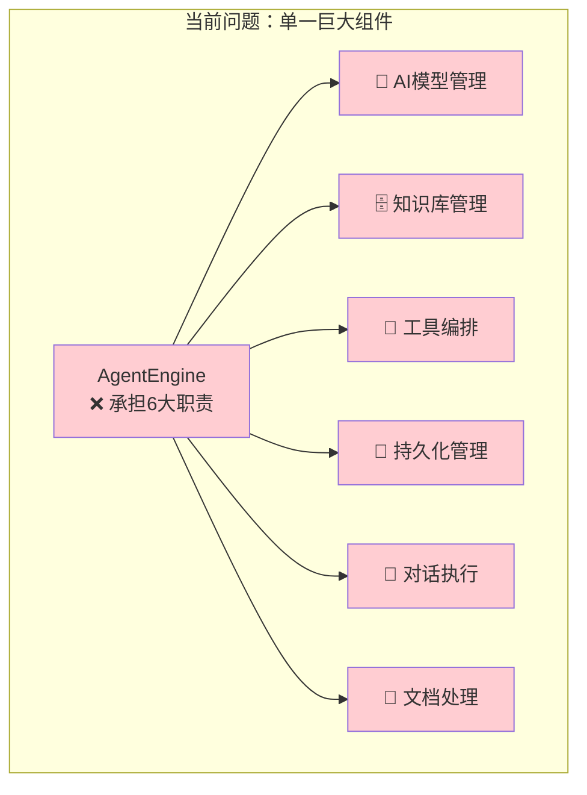
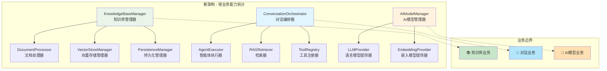
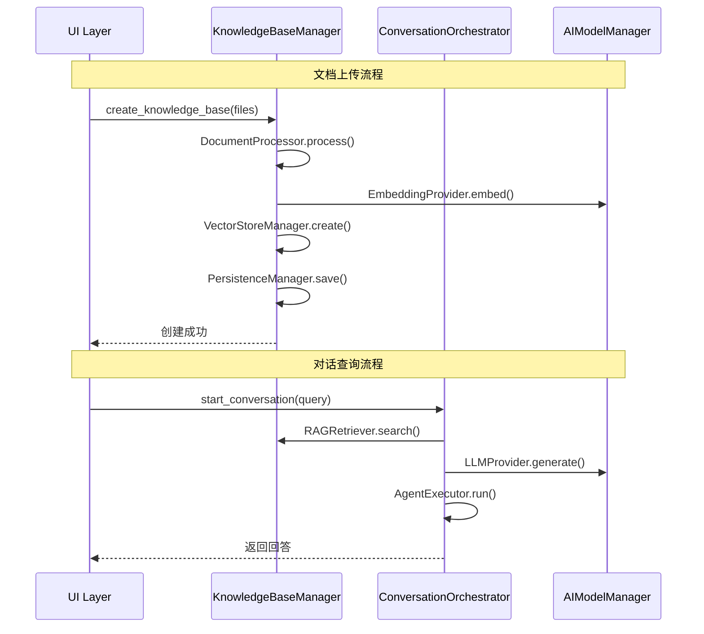

# 🛠️ 技术架构

本文档详细概述了 AI 办公助手的当前技术实现。有关未来计划和战略方向，请参阅 `docs/PROJECT_ROADMAP.md`。

---

## 1. 系统概述

AI 办公助手是一款专为公司内部使用而设计的安全、全栈式 AI 助手。它利用检索增强生成 (RAG) 架构，提供一个对话式界面，用于与用户上传文档创建的私有知识库进行交互。该系统采用核心逻辑与用户界面清晰分离的设计，确保了可维护性和可扩展性。

---

## 2. 核心架构 (`src/core/`)

该层包含应用程序的主要业务逻辑，与 UI 完全解耦。

### 2.1. `engine.py` - RAG 与智能体引擎
- **目的**：管理 AI 的核心功能，包括文档处理、向量存储和对话推理。
- **关键组件**：
    - **`AgentEngine` 类**：协调所有 AI 操作的中心类。
    - **向量存储**：使用 `FAISS` 对文档嵌入进行高效的本地相似性搜索。
    - **LLM 与嵌入**：与 OpenAI 模型 (`gpt-4o-mini`, `text-embedding-3-small`) 集成，用于语言理解和生成。
    - **智能体与工具**：实现一个 `LangChain` 智能体，该智能体可以使用一套专用工具。工具已模块化并组织在 `src/core/tools/` 目录中，包括知识库问答、文档摘要、技术规格提取和链路预算计算。
    - **持久化**：处理 FAISS 索引和文档元数据到 `persistent_storage/` 目录的序列化和反序列化，使状态能够在会话之间保持。

### 2.2. `parser.py` - 文档解析器
- **目的**：提供从各种文件格式中稳健提取文本内容的功能。
- **`DocumentParser` 类**：
    - 支持 `.pdf`、`.docx` 和 `.txt` 文件类型。
    - 集成 `pytesseract` 进行光学字符识别 (OCR)，从而能够从基于图像的 PDF 中提取文本。
    - 将特定于文件的解析逻辑封装在静态方法中，以提高清晰度。

### 2.3. `tools/` - 模块化工具架构
- **目的**：提供可维护、可扩展的工具组织结构。
- **架构特点**：
    - **工具分离**：每个工具在独立文件中，便于维护和测试。
    - **工厂模式**：使用工厂函数绑定工具与引擎实例。
    - **功能分组**：按功能领域组织（知识库、文档、技术、计算）。
- **工具目录结构**：
    ```
    src/core/tools/
    ├── __init__.py              # 工具注册和导出
    ├── knowledge_base/
    │   └── qa.py               # 知识库问答工具
    ├── document/
    │   └── summarizer.py       # 文档摘要工具
    ├── technical/
    │   └── spec_extractor.py   # 技术规格提取工具
    └── calculations/
        └── link_budget.py      # 链路预算计算工具
    ```

### 2.4. `session.py` - 会话状态管理
- **目的**：在 Streamlit 会话中管理应用程序的状态。
- **职责**：
    - 在应用程序启动时初始化 `AgentEngine`。
    - 管理聊天记录 (`st.session_state.chat_history`)。
    - 跟踪知识库状态 (`st.session_state.kb_initialized`)。
    - 处理应用程序重置逻辑。

---

## 3. UI 架构 (`src/ui/`)

该层负责渲染用户界面和处理用户交互。它被设计成一个主要调用核心逻辑的“哑”层。

### 3.1. `layout.py` - 主应用程序布局
- **目的**：定义 Streamlit 应用程序的主要结构。
- **功能**：
    - `render_sidebar()`：构建侧边栏，根据应用程序的状态动态显示初始上传视图或知识库管理视图。
    - `render_main_chat()`：渲染用户与 AI 互动的主聊天界面。

### 3.2. `components/` - 可重用 UI 模块
- **目的**：将 UI 分解为更小、可管理和可重用的组件。
- **模块**：
    - `knowledge_base.py`：渲染文档列表，包括用于 `Summarize` 和 `Delete` 操作的扩展器。实现用于可滚动内容的动态容器。
    - `upload.py`：处理用于初始创建和向现有知识库添加文档的文件上传小部件。
    - `chat.py`：管理聊天消息历史的渲染。

### 3.3. `styles/` - 样式
- **目的**：集中管理应用程序的所有自定义 CSS，以确保一致的外观和感觉。

---

## 4. 数据流与持久化

1.  **初始化**：启动时，`session.py` 尝试从 `persistent_storage/` 目录加载一个持久化的 `AgentEngine`。
2.  **知识库创建**：
    - 用户通过 `upload.py` 中的 UI 上传文件。
    - `engine.py` 使用 `parser.py` 提取文本。
    - 使用 `OpenAIEmbeddings` 对文本进行分块和向量化。
    - 生成的 `FAISS` 索引和元数据保存到磁盘。
3.  **聊天互动**：
    - 用户通过 `chat.py` 中的 UI 提交查询。
    - `engine.py` 中的 `AgentEngine` 接收查询。
    - 智能体决定使用哪个工具。对于问答，`rag_chain` 从 `FAISS` 向量存储中检索相关的文档块。
    - 检索到的上下文和用户查询被发送到 LLM 以生成响应。
    - 对话在 `st.session_state` 中更新。

---

## 5. 架构重构计划

当前的架构存在一些可改进的地方，特别是 `engine.py` 承担了过多职责。基于业界最佳实践，我们制定了详细的重构计划。

### 5.1. 当前架构问题



### 5.2. 目标架构设计



### 5.3. 新模块职责分工

| 模块 | 职责 | 为什么这样命名 |
|------|------|----------------|
| **`KnowledgeBaseManager`** | 管理整个知识库生命周期 | 直接表明管理知识库的核心职责 |
| **`DocumentProcessor`** | 文档解析、文本分割、验证 | 专门处理文档相关操作 |
| **`VectorStoreManager`** | FAISS向量存储操作 | 专门管理向量存储 |
| **`PersistenceManager`** | 数据持久化保存/加载 | 专门负责持久化 |
| **`ConversationOrchestrator`** | 编排对话流程 | 编排整个对话过程 |
| **`AgentExecutor`** | 执行AI Agent | 专门执行Agent |
| **`RAGRetriever`** | RAG检索逻辑 | 专门负责检索增强 |
| **`ToolRegistry`** | 工具注册和管理 | 专门管理工具 |
| **`AIModelManager`** | AI模型管理 | 管理所有AI模型 |

### 5.4. 重构后的数据流



### 5.5. 重构收益

**代码质量提升：**
- ✅ 每个类职责单一，易于理解和维护
- ✅ 描述性命名，一目了然
- ✅ 高内聚低耦合，便于测试

**团队协作改善：**
- ✅ 并行开发，提高效率
- ✅ 专业化分工，降低学习成本
- ✅ 代码审查更有针对性

**系统扩展性：**
- ✅ 更容易添加新功能
- ✅ 可以针对性优化特定模块
- ✅ 技术栈升级更灵活

> 📋 **详细重构计划**：完整的架构重构计划请参考 [`docs/architecture-refactoring-plan.md`](./architecture-refactoring-plan.md) 